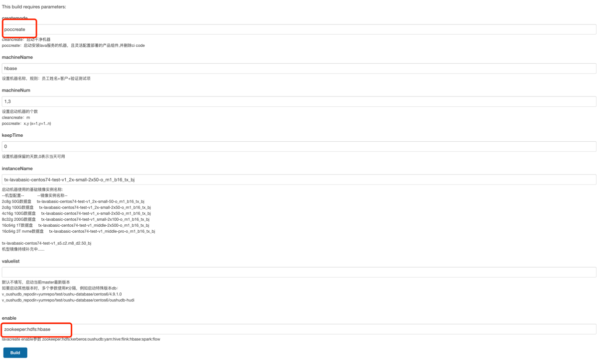
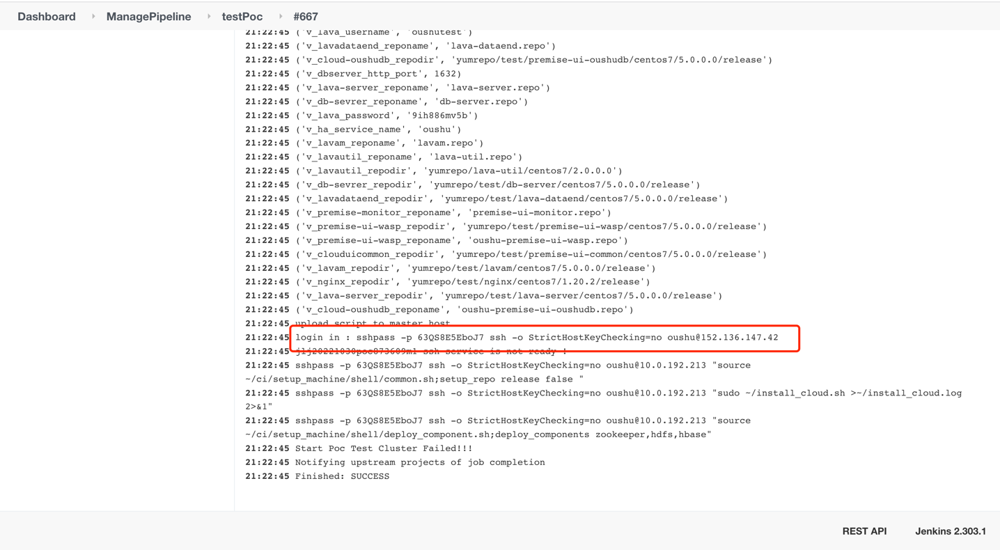

### 1. 创建HBase后端环境
浏览器登录 http://82.157.60.107:10000/view/ManagePipeline/job/testPoc/build?delay=0sec
填写如下参数，创建服务器


创建成功之后，在日志的最后找到机器的连接方式


### 2. 创建测试数据以及元数据
```shell
sudo su - hbase
sqlline.py
# 然后将init.sql的内容拷贝进去，全部执行
!quit
```

### 3. 本地机器的/etc/hosts修改

```shell
sudo vim /etc/hosts
# 添加三台节点的hosts
```

### 4. 启动后端

```shell
# 修改配置
vim ${phoenix_home}/backend/src/main/resources/hbase-site.xml
# 将hbase.zookeeper.quorum 配置项修改为三台机器的公网地址
cd ${phoenix_home}/backend
mvn clean package
cd target
java -jar phoenix-studio-backend-1.0-SNAPSHOT.jar
```
